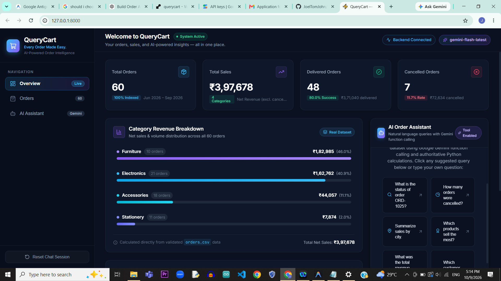
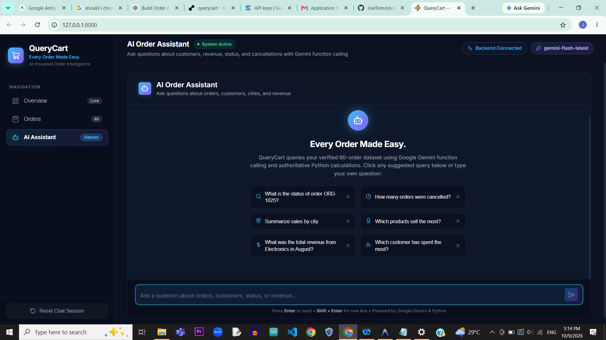
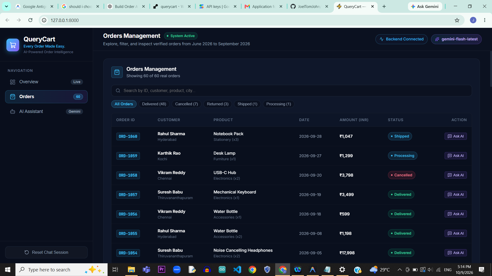

# QueryCart — Ask your orders anything.

> **AI-Powered Order Intelligence for E-Commerce**

QueryCart is a production-grade fullstack order analytics platform that connects an AI assistant with a real e-commerce order dataset (`orders.csv`). Using native Google Gemini tool calling and authoritative Python calculations, QueryCart answers complex questions about orders, cancellations, revenue, and customer spending with mathematical precision and zero hallucinations.

---

## Screenshots

### Executive Analytics Dashboard
Real-time KPI metrics, category revenue distributions, and instant AI query launchpads.



### AI Order Assistant
Conversational interface powered by Google Gemini function calling and deterministic Python calculations.



### Order Filters & Management
Instant order table indexing with multi-status filtering (Delivered, Cancelled, Returned, Shipped, Processing) and search.



---

## Architecture Overview

```
QueryCart/
├── orders.csv                 # Canonical dataset (60 orders, Jun-Sep 2026)
├── requirements.txt           # Python backend dependencies
├── render.yaml                # Render Blueprint deployment configuration
├── .env.example               # Environment variables template
├── .gitignore                 # Git ignore rules
├── README.md                  # Comprehensive documentation
├── WRITEUP.md                 # Engineering writeup and architecture notes
├── backend/
│   ├── config.py              # Environment and configuration loader
│   ├── schemas.py             # Pydantic schemas for requests, responses, tools
│   ├── data_loader.py         # CSV ingestion, validation, and in-memory cache
│   ├── tools.py               # Native tool definitions & authoritative calculation engine
│   ├── ai_agent.py            # Google Gemini tool-calling loop, guardrails, & error handling
│   ├── main.py                # FastAPI application & SPA static asset mount
│   └── tests/
│       ├── test_tools.py      # Unit tests for lookup, search, and metrics calculations
│       └── test_api.py        # API endpoint tests, validation, mocked tool calling
└── frontend/
    ├── package.json           # Frontend dependencies & scripts
    ├── vite.config.js         # Vite configuration with proxy & Vitest setup
    ├── index.html             # HTML entry point with fonts & metadata
    └── src/
        ├── App.jsx            # Main application orchestrator
        ├── index.css          # SaaS design system (Dark navy, indigo, cyan)
        ├── api.js             # Backend client for /health and /api/chat
        ├── components/        # Modular UI components
        └── __tests__/         # Vitest & React Testing Library tests
```

---

## Calculation Assumptions & Policies

1. **Monetary Unit**: All monetary amounts are processed, aggregated, and displayed in **INR (₹)**.
2. **Authoritative Revenue Policy**:
   - **Net Revenue**: Sum of `total_inr` for all non-cancelled orders (`status != 'cancelled'`), including delivered, shipped, processing, and returned.
   - **Delivered Revenue**: Sum of `total_inr` strictly for orders with `status == 'delivered'`.
   - **Gross Order Value**: Sum of `total_inr` across all orders, including cancelled.
   - **Cancelled Revenue**: Total revenue lost due to cancelled orders (`status == 'cancelled'`).
3. **Date Boundaries**:
   - Inclusive boundaries: `start_date <= order_date <= end_date`.
   - All dataset records are in the year 2026 (June 1, 2026 – September 28, 2026).
   - "August" automatically resolves to `start_date="2026-08-01"` and `end_date="2026-08-31"`.
4. **Tool Selection Guarantee**: The AI model never guesses arithmetic or invents orders. Every question triggers backend tool execution (`lookup_order`, `search_orders`, or `calculate_order_metrics`), and responses are synthesized directly from returned data.

---

## Local Setup on Windows (PowerShell)

### Prerequisites
- Python 3.9+ installed
- Node.js 18+ and npm installed

### Step 1: Clone or Navigate to the Workspace
```powershell
cd c:\Users\thoma\OneDrive\Desktop\QueryCart
```

### Step 2: Set Up Python Virtual Environment
```powershell
# Create virtual environment
python -m venv venv

# Activate virtual environment
.\venv\Scripts\Activate.ps1

# Upgrade pip and install backend dependencies
pip install -r requirements.txt
```

> **Note for PowerShell execution policy**: If you encounter an execution policy error when activating `venv`, run:
> ```powershell
> Set-ExecutionPolicy -ExecutionPolicy RemoteSigned -Scope CurrentUser
> ```

### Step 3: Configure Environment Variables
Copy `.env.example` to `.env`:
```powershell
Copy-Item .env.example .env
```

Open `.env` in any text editor and supply your Gemini API key:
```ini
GEMINI_API_KEY=your_gemini_api_key_here
GEMINI_MODEL=gemini-flash-latest
PORT=8000
ORDERS_CSV_PATH=orders.csv
ENVIRONMENT=development
```

*(Note: The entire app, backend test suite, and frontend build function completely even without an API key, providing helpful configuration banners in the UI).*

### Step 4: Install Frontend Dependencies
Open a second PowerShell terminal:
```powershell
cd c:\Users\thoma\OneDrive\Desktop\QueryCart\frontend
npm install
```

---

## Running Locally

### Option A: Concurrent Development (Recommended for Development)
**Terminal 1 (Backend - FastAPI):**
```powershell
cd c:\Users\thoma\OneDrive\Desktop\QueryCart
.\venv\Scripts\Activate.ps1
uvicorn backend.main:app --reload --port 8000
```
*Backend runs at: `http://localhost:8000` (API Docs at `http://localhost:8000/docs`)*

**Terminal 2 (Frontend - Vite Dev Server):**
```powershell
cd c:\Users\thoma\OneDrive\Desktop\QueryCart\frontend
npm run dev
```
*Frontend runs at: `http://localhost:5173` with automatic proxy to `http://localhost:8000`.*

---

### Option B: Production Unified Run (Single Port)
You can compile the frontend and serve everything from FastAPI:
```powershell
# 1. Build frontend
cd c:\Users\thoma\OneDrive\Desktop\QueryCart\frontend
npm run build
cd ..

# 2. Run FastAPI (serves both API & Frontend SPA)
.\venv\Scripts\Activate.ps1
uvicorn backend.main:app --port 8000
```
*Visit `http://localhost:8000` in your browser!*

---

## Running Tests

### Backend Tests (pytest)
Runs 35 automated tests covering order lookup, case-insensitivity, search filters, revenue calculations, cancellation statistics, undelivered order tracking, rate-limit fallback, automatic function calling limits, response caching, isolated dataset fixtures, request validation, mocked Gemini function calling, and provider failure handling:
```powershell
cd c:\Users\thoma\OneDrive\Desktop\QueryCart
.\venv\Scripts\pytest -v backend/tests
```

### Frontend Tests (Vitest & React Testing Library)
Runs 8 automated tests covering the chat interface, 4 example question flows, message bubbles, loading states, error handling with retry, chat reset, and graceful 429 quota handling:
```powershell
cd c:\Users\thoma\OneDrive\Desktop\QueryCart\frontend
npm test
```

### Frontend Production Build Test
```powershell
cd c:\Users\thoma\OneDrive\Desktop\QueryCart\frontend
npm run build
```

---

## API Reference Examples

### 1. Health Check
**Endpoint**: `GET /health`

**PowerShell Example**:
```powershell
Invoke-RestMethod -Uri "http://localhost:8000/health" -Method Get
```

**Response**:
```json
{
  "status": "healthy",
  "dataset_loaded": true,
  "total_orders": 60,
  "gemini_configured": true,
  "model_name": "gemini-flash-latest",
  "version": "1.0.0"
}
```

---

### 2. Chat Endpoint
**Endpoint**: `POST /api/chat`

**PowerShell Example**:
```powershell
$body = @{
    message = "What was the total revenue from Electronics in August?"
    history = @()
} | ConvertTo-Json

Invoke-RestMethod -Uri "http://localhost:8000/api/chat" -Method Post -ContentType "application/json" -Body $body
```

**Response**:
```json
{
  "reply": "The total delivered revenue for Electronics in August 2026 was **₹16,692** across 3 delivered orders (plus 1 cancelled order for ₹10,497).",
  "tool_calls": [
    {
      "tool_name": "calculate_order_metrics",
      "arguments": {
        "category": "Electronics",
        "start_date": "2026-08-01",
        "end_date": "2026-08-31"
      },
      "result": { ... }
    }
  ]
}
```

---

## Publishing to GitHub

```powershell
cd c:\Users\thoma\OneDrive\Desktop\QueryCart

# Initialize git if not already initialized
git init

# Stage all files
git add .

# Commit
git commit -m "feat: complete QueryCart order intelligence application"

# Add your GitHub repository remote
git remote add origin https://github.com/<YOUR_USERNAME>/QueryCart.git
git branch -M main

# Push to GitHub
git push -u origin main
```

---

## Deploying on Render

QueryCart is pre-configured with `render.yaml` for a zero-configuration Blueprint deployment:

1. Log into your [Render Dashboard](https://dashboard.render.com/).
2. Click **New +** and select **Blueprint**.
3. Connect your GitHub repository `QueryCart`.
4. Render will read `render.yaml` and configure the Web Service with:
   - **Build Command**: `pip install -r requirements.txt && cd frontend && npm install && npm run build && cd ..`
   - **Start Command**: `uvicorn backend.main:app --host 0.0.0.0 --port $PORT`
5. In the environment variables section, set:
   - `GEMINI_API_KEY`: Your Google Gemini API key.
   - `GEMINI_MODEL`: `gemini-flash-latest` (or your preferred Gemini model).
6. Click **Apply**.
7. Once deployed, Render provides your live HTTPS URL (e.g., `https://querycart.onrender.com`).
